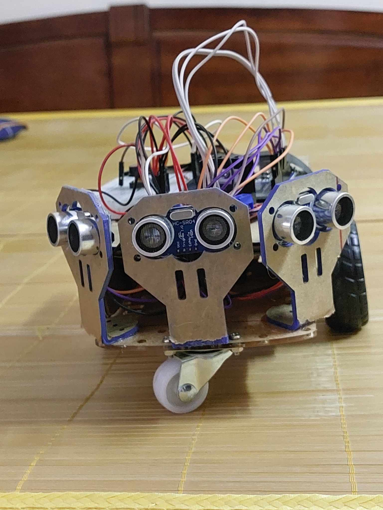
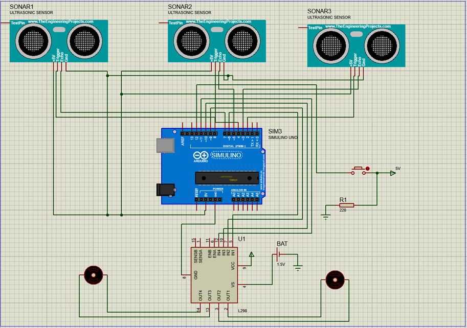

# IT4210 - Hệ nhúng

## Đại học Bách Khoa Hà Nội - Trường CNTT & TT
## Giảng viên hướng dẫn: [ThS. Nguyễn Đức Tiến](https://soict.hust.edu.vn/ths-nguyen-duc-tien.html)

## Sinh viên thực hiện:
1. **[Trần Hàn Minh](https://github.com/Hanminh) - 20210605**
2. **[Nguyễn Đức Duy](https://github.com/Dxy1307) - 20210275**
3. **[Cao Ngọc Thắng](example.com) - 20215644**

### Sản phẩm
**Giới thiệu** 
- Xây dựng một robot theo dõi con người bằng Arduino và ba cảm biến siêu âm là một dự án thú vị. Điều khiến dự án này trở nên đặc biệt thú vị là việc sử dụng không chỉ một mà đến ba cảm biến siêu âm. 
- Ta thường thấy con người chế tạo robot theo sau với một động cơ siêu âm, hai IR và một động cơ servo. Động cơ servo này không có vai trò gì trong vận hành và còn gây thêm những rắc rối không đáng có. Vì vậy dự án  đã loại bỏ cảm biến servo và IR này và sử dụng 3 cảm biến siêu âm. 
- Với cảm biến siêu âm, bạn có thể đo khoảng cách và sử dụng thông tin đó để điều hướng và theo dõi mục tiêu của con người.

**Chức năng**
- Chức năng chính: Đi theo vật thể có khoảng cách tới cảm biến gần nhất với khoảng cách mỗi cảm biến đo được trong khoảng 10cm - 40cm, robot có thể dii chuyển theo vật thể chuyển động hướng thẳng, trái, phải (*không di chuyển vật thể quá nhanh*).

 (https://www.youtube.com/watch?v=2TX0AcyOWdI)

***Chức năng chính***

- Test hoạt động của động cơ: có một nút bấm trên xe để thực hiện test, lần nhất đầu xe sẽ thực hiện tiến, lùi, quay trái, quay phải. Lần nhấn tiếp theo xe sẽ thực hiện bốc đầu 3 lần nhằm kiểm tra độ bền xe và linh kiện.

 (https://www.youtube.com/watch?v=vXmJbE9swAE)

***Lần nhấn đầu***

 (https://www.youtube.com/watch?v=3Hit6-cMGZo)

***Lần nhấn tiếp theo***

- Chú ý: Chỉ sử dụng trên bề mặt rắn và phẳng.

### Chi tiết dự án

**Linh kiện**

|    Linh kiện     | Số lượng  | Giá       |
|:-----------------|:---------:|----------:|
| Arduino Uno      |    1      | 150,000đ  |
| Model điều khiển động cơ L298N       |    1      | 200,000đ  |
| Cảm biến siêu âm (Ultrasonic Sensor)       |    1      | 150,000đ  |
| Động cơ DC       |    2      |   |
| Bánh xe + Khung Robot          |    2      | 70,000đ  |
| Board mở rộng (Breadboard)       |    1      | 20,000đ  |
| Dây nối và đầu nối       |    NaN      |   |
| Nút bấm       |    1      | 20,000đ  |
| Điện trở 220Ω       |    1     |   |

**Sơ đồ mạch**

**Thiết kế phần mềm**
- Nút bấm: Trạng thái nút bấm được xác định bởi hàm đọc digitalWrite() và được xử lý bằng 2 biến trạng thái lastState (Trạng thái trước đó) và curState ( Trạng thái hiện tại) cùng 1 biến đếm countPush ( biến đếm chỉ tăng khi trạng thái nút bấm chuyển từ LOW sang HIGH – tương đương với 1 lần bấm ). Nút bấm được dùng để thực hiện chế độ Test, chế độ này được thực hiện trong quá trình phát triển sản phẩm, nhằm kiểm tra hoạt động đồng thời cũng như riêng lẻ của từng động cơ.

- Ultrasonic Sensor: Cảm biến được dùng để đo khoảng cách bằng cách gửi 1 xung siêu âm với tần số cao, nếu có vật thể, xung sẽ phản lại, bằng cách tính toán thời gian di chuyển và tốc độ âm thanh, khoảng cách có thể được ghi lại.

- Motor: Motor được dùng để tạo chuyển động quay cho bánh xe, tốc độ quay và chiều quay của motor được xác định bởi sự chênh lệch điện áp giữa cực dương và cực âm, thực hiện đi thẳng khi chệch lệch trên là điện áp dương, đi lùi nếu chênh lệch trên là âm, thực hiện rẽ trái và rẽ phải với việc motor 2 bánh quay theo 2 chiều khác nhau. Việc điều chỉnh sự chênh lệch điện áp giữa 2 cực được thực hiện bởi hàm analogWrite().

### Kết luận
- Xây dựng một robot theo dõi con người bằng cách sử dụng Arduino và ba cảm biến siêu âm là một dự án thú vị và bổ ích, kết hợp giữa lập trình, điện tử và cơ khí. Với tính linh hoạt của Arduino và sự sẵn có của các thành phần giá cả phải chăng, việc tạo ra robot theo dõi con người của riêng bạn là trong tầm tay.
- Robot theo dõi con người có nhiều ứng dụng ở nhiều lĩnh vực khác nhau như chúng có thể được sử dụng trong các cửa hàng bán lẻ, trung tâm thương mại và khách sạn để cung cấp hỗ trợ cá nhân hóa cho khách hàng. Robot theo dõi con người có thể được sử dụng trong hệ thống an ninh và giám sát để theo dõi và giám sát các cá nhân trong không gian công cộng. Chúng có thể được sử dụng trong Giải trí và sự kiện, chăm sóc người già, các chuyến tham quan có hướng dẫn, nghiên cứu và phát triển, giáo dục và nghiên cứu cũng như robot cá nhân.
- Chúng chỉ là một vài ví dụ về ứng dụng của robot theo dõi con người. Khi tiến bộ công nghệ và robot tiếp tục phát triển, chúng ta có thể mong đợi những ứng dụng đa dạng và sáng tạo hơn nữa trong tương lai.
